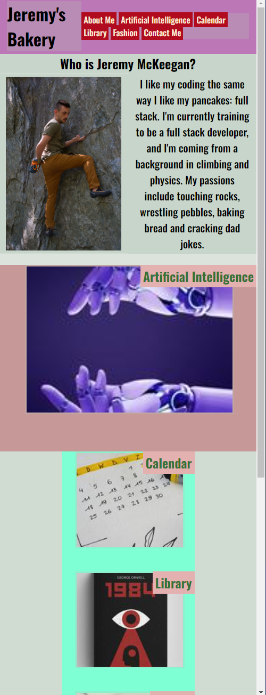
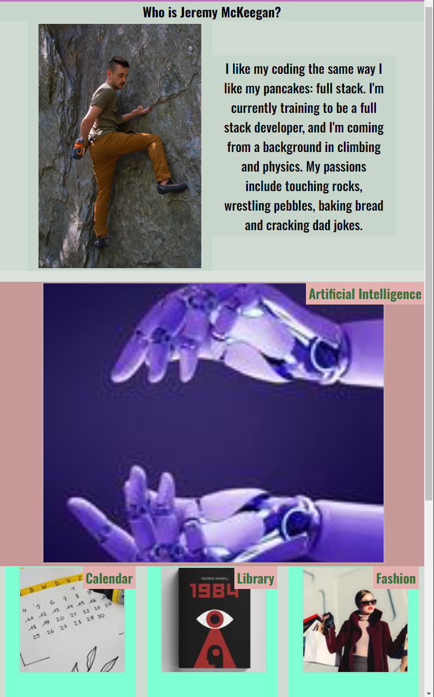
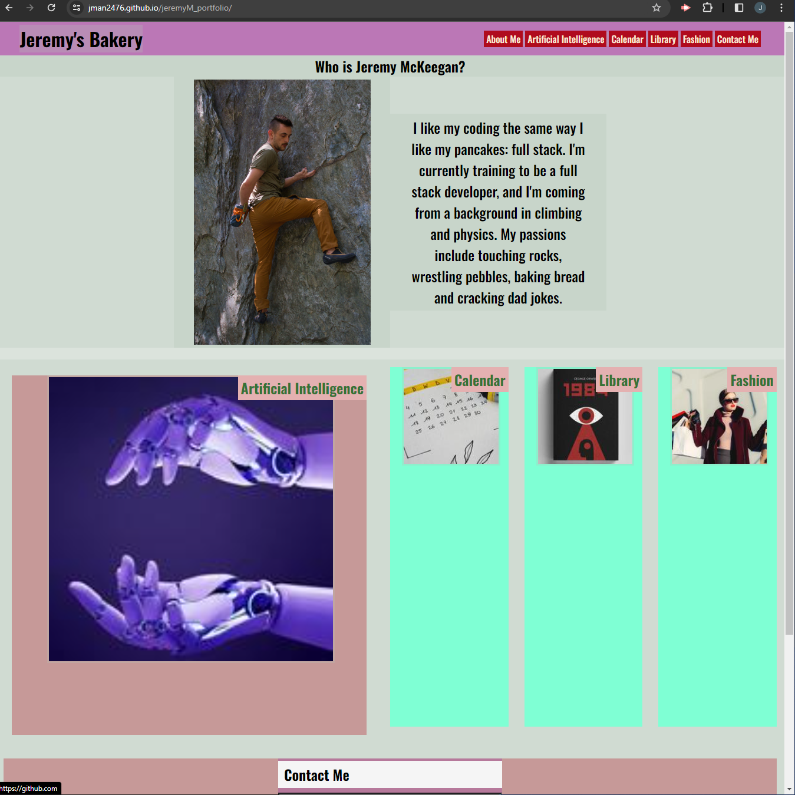

# Jeremy McKeegan's Portfolio

## Description

This portfolio is meant to be a collecting point for the projects that I have worked on, and a repository for information about me. The navigation links at the top will bring you to each of the corresponding sections, including an About Me section, portfolio sections, and a Contact Me section. By clicking on each of the portfolio items, it should take you to the corresponding application, however, I do not have that many applications so all of them just redirect to Github. Also, because I'm not yet proficient in Javascript, the Contact Me section has three text boxes but the page has no way of reading or sending the information typed into the boxes.

## Challenges and Lessons

The hardest part of this project was setting up all of the nested elements, and then going back to format them and completely braking my entire website. It really helped me learn more about reverse engineering my own code to find the problem, and how having tidy code makes things easier to debug, even if convoluted. On a scale of wet to dry, I would rate my code as damp. I will leave full code desication as an exercise for the reader.

I think another important thing I learned is that I do not have a passion for graphic design. Some might come to my website an be woe at the intense colors and endulgent margins and padding, but I find myself yearning to build interactivity and substance into my websites, not to simply give prospective employers a signpost towards something I've done better. I'd want my future portfolio to be fun, not a piece of cardboard.

## Gallery

Here's a gallery of how the page displays differently at 500px, 800px, and wider than 1050px:

## License

MIT License     

## Badges

